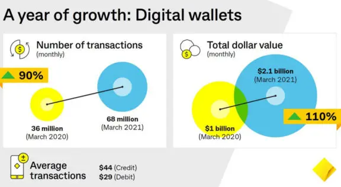
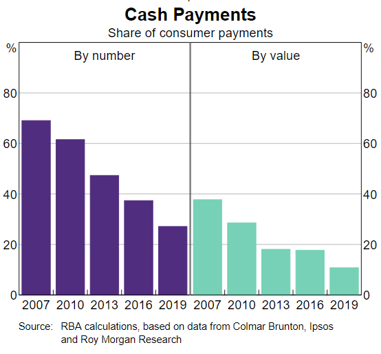
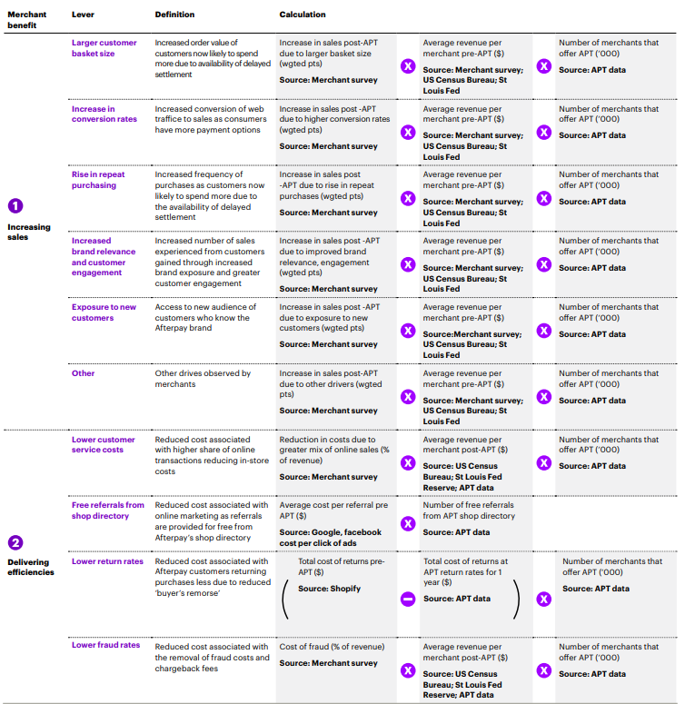

# Case Study: Afterpay
## Overview
Afterpay is a global Fintech provider based in Australia. They provide a buy now, pay later (BNPL) service to consumers. They were founded in 2014 in Sydney, by Nicholas Molnar and Anthony Eisen (ABC 2022).

In his early twenties, Molnar had his first experiences in entrepreneurship through running an eBay jewellery business. In fact, he was the site’s largest seller (NBR 2021). He was able to identify that his target audience, mostly women in their twenties, were averse to credit cards. Meanwhile, the growth of e-commerce was accelerating, traditional retailers had phased out lay-by, and interest rates on credit cards were high (NBR 2021). Molnar identified an opportunity for a zero-interest scheme, tackling both a customer demand, and a business goal to boost sales at minimal cost. Afterpay’s first retail customer was a fashion brand, Princess Polly, who immediately saw success with average basket sizes increasing by $44, and revenues increasing 15% (Smartcompany 2021).

Afterpay initially had trouble at its first round of funding, only just managing to raise the $8 million needed to satisfy their technology partner, Touchcorp (AFR, 2021). A year later, they listed on the Australian Stock Exchange (ASX) with a valuation of $100 million, raising $25 million through its initial public offering (Reuters 2022). In 2020, Afterpay raised an additional $800 million to take advantage of the increase in online shopping during lockdowns, and in 2021 Square acquires Afterpay for $29 billion. 

Afterpay makes money through two different means. First, their merchant network pays a percentage fee on each sale processed through Afterpay, which is typically between 4-6% of the total transaction value (Finty 2022). The merchant fees make up the majority of earnings (Finty 2022). The second way they make money is through their late payment fees, where customers are charged $10 if a payment isn’t made on time, although this accounts for less than 10% of Afterpay’s earnings (Finty 2022). 

## Business Activities
Afterpay was founded to empower customers by giving them access to interest-free credit, whereby they can pay for goods and services in four instalments rather than a lump sum (Afterpay). In doing this, Afterpay has flipped the traditional credit model to provide a more customer-centric product, whilst also delivering merchants significant value and reduced risk (as Afterpay takes responsibility for customer defaults) (The Strategy Story 2022). 

Their central target market is consumers who are seeking alternatives to traditional credit products. Interestingly, Afterpay integrates stricter spending limits on new users, allowing customers with good spending behaviour (i.e. making payments on time) to increase their spending limits (Afterpay Target Market Determination). Furthermore, reports have shown that in 2021, around 73% of users will millennials or Gen Z (Insider Intelligence 2021). This is also supported by a report conducted by the RBA, showing that more than 55% of BNPL users were aged under 40 (RBA 2021). In 2021, Afterpay reported 16.2 million active customers, an increase of 63% from the previous financial year (Afterpay Annual Report FY2021). Additionally, they reported over 90,000 active merchants, up 77% from the previous financial year (Afterpay Annual Report FY2021). 

Some of the benefits that Afterpay has over its competitors revolve around them enforcing limits on customer spending. For example, “the most a customer is allowed to spend on Afterpay is $2000, with single transactions limited to $1500” (Mr Eisen, Financial Review 2019), and as mentioned above, new users start with lower spending caps. This helps to ensure that customer's do not fall into negative spending habits and spend more than they can afford. 

Due to the large amounts of data being generated by Afterpay every day, including customer transactions, website views and consumer referrals, it is necessary for them to be able to use those insights to improve customer experience and increase value for merchants (Afterpay Tech Blog 2020). Afterpay decided to build a JupyterHub based Data Science platform to leverage the use of machine learning whilst upholding the highest level of security possible, ensuring any code run on their data is logged and traceable (Afterpay Tech Blog 2020). 

Furthermore, Afterpay designed Cloud Cover, their Amazon Web Services (AWS) identity and access management (IAM) tool (Afterpay Tech Blog 2021). They designed Cloud Cover to reduce the risk of attacks in their AWS environments, and to ensure their engineers can work securely without compromising their efficiency (Afterpay Tech Blog 2021). 

Another interesting way in which Afterpay has harnessed the power of technology is through the rebuild of their search function on their website. Previously, the feature was based on matching searches to keywords that they assigned to stores using algorithms (Afterpay Tech Blog 2021). However, this had limitations as they might not have covered all relevant key words or included information about certain products or brands the store may carry. Afterpay used the power of Kafka to send data to an Amazon data warehouse, where an indexing service, Apache Airflow, reads and writes the data into the search index (Afterpay Tech Blog 2021). Next, the search service calls Elasticsearch to find relevant stores using multi-match queries, which searches over store names, products and categories, whilst recording all search events and sending them back to Kafka to improve future matching (Afterpay Tech Blog 2021). 

## Industry Landscape
Afterpay is in the payments domain. The sector has experienced a major transformation in the past 5 years, with the pandemic lockdowns being a driving force. Consumers are embracing digital payments more, such as contactless payments, BNPL services and cryptocurrency payments (IR 2022). This is further evidenced by the fact that cash use in Australia has fallen from two-thirds of consumer payments a decade ago, to less than one-third at present (Treasury 2021). Additionally, 63% more Australian’s transacted in digital assets in 2021 compared to 2020 (Treasury 2021). Worldplay Global suggests that 25% of e-commerce spending was through digital wallets such as PayPal, and will lead the sector by 2024 (World Play Global 2022). Additionally, they reported that BNPL is the fastest growing method for online payments (World Play Global 2022). 

Interestingly, the findings show that cash use is decreasing the most rapidly, with Australia predicted to use the least cash in the APAC region by 2025 (Channel Life 2022). The mentioned statistics are further supported by the following graphs, which represent first a 90% increase in the number of digital transactions from Commonwealth Bank of Australia, and second, the decreasing use of cash payments in Australia over time. 

Some of the major company’s in the payments domain are obviously the banks, for example Commonwealth Bank, Westpac, and ANZ. But we also have the newer emergents driving the growth of digital payments, such as PayPal, Stripe, Square, even Google and Apple have entered the market with their digital wallet platforms. Additionally, we have some direct competitors to Afterpay in the BNPL industry, such as Zip Pay, Klarna and Openpay.

On another note, one of the emerging trends to look out for is the potential for central bank digital currencies (CBDC) and cryptocurrencies to go mainstream. BPAY lead Keith Brown says “once cryptocurrencies get into big organisations like major banks, then your average person will start to use them” (BPAY Group 2022).  The Royal Bank of Australia has also announced that they have partnered with the Digital Finance Cooperative Research Centre to explore use cases for a CBDC and what benefits it may bring to the economy (RBA 2022). One of the major benefits of a CBDC is that it could save global companies up to $100 billion in transaction fees per year (JP Morgan 2021). 

## Results
Afterpay has had various positive impacts for both consumers and for merchants. First, this paper will focus on the impacts for merchants. According to research conducted by Accenture, customer basket sizes are 17% higher in value compared to before Afterpay was added to a merchant’s offerings (Accenture Economic Impact 2021). Typically, Afterpay merchant’s also report a customer increase of, on average, 13%, with a high rate of repeat purchases (IPSOS survey of US BNPL (Afterpay) merchants 2021). Coupled with these factors, a partnership with Afterpay also reduces customer service and acquisition costs, and also lowers marketing costs, fraud and return rates for merchants, resulting in a reported $590 million savings in 2021 (Accenture Economic Impact 2021). This translates to a 13% reduction in merchant’s operating expenses (Accenture Economic Impact 2021). Additionally, $8.2 billion in new revenue was created for merchants through:
- Increased customer basket value;
- Increased repeat purchases;
- New customer exposure;
- Increased brand relevance
- Improved customer engagement, and;
- Increased checkout conversion rates (Accenture Economic Impact 2021).

On another note, it is worth mentioning that in 2020, customers saved $110 million in consumer fees and interest charges by using Afterpay instead of a credit card (Afterpay Economic Impact 2020). In 2021, Afterpay launched a new phase of their Pulse Rewards program where every customer can join and earn points as a reward for responsibile spending, such as making payments on time (Afterpay Annual Report 2021). Customers will be able to move through tiers to receive new beneftis including exclusive offers from various brands and early access to sales (Afterpay Annual Report 2021). Furthermore, alongside the Australian Retailers Association, "Afterpay has commissioned the creation of a free financial literacy program for retail workers" (Afterpay Annual Report 2021).

To measure the success of Afterpay, I’d like to look at a few metrics of growth. Notably, the company saw an increase of 78% in revenue in 2021 when compared to the previous year ($924.7m) (Annual Report FY2021). Their active customer base grew 63% in the same period, to a staggering 16.2 million users (Annual Report 2021). Also, their active merchant figures grew by 77%, with over 100,000 recorded (Annual Report 2021).

In comparison, for the 2021 financial year, Zip Pay reported just under $400m revenue, with 51,000 merchant partners and over 7m customers (Zip Pay Annual Report 2021). Openpay reported $26m revenue, over 500k customers and under 4,000 merchant partners for the 2021 period (Openpay Annual Report 2021). Although both of these companies are still experiencing significant growth year on year, we can see that Afterpay dominates the BNPL market.

## Recommendations
One service that could be beneficial for Afterpay to implement is the use of cryptocurrency to minimise the cost of fees, for example card issuer fees, interchange fees, processing fees and so on. With the use of cryptocurrency as a payment form, there would only need to be one fee, to validate the transaction on the blockchain. Afterpay states that “merchants will benefit considerably from the cryptocurrency model as card network fees are entirely removed… and the customer bears the transaction costs” (SMH 2021). This would allow for complete transparency of the cost of fees. On the other hand, this would mean that Afterpay would no longer be a free service for the customer, and may result in a decrease of use while customers look for other free to use options. Depending on the blockchain used however, the fees could be so minimal that it isn’t a concern, for example on the Polygon and Fantom blockchains, fees cost less than one cent (FTM Scan, n.d.).

Another service that Afterpay could tap into is increased spending limits, which are currently capped at $1500, with a maximum outstanding account limit of $2000 (Choice 2021). They could also look at additional options with loan periods to give customers increased flexibility in their spending. For example, competitor Affirm has loan offers ranging from 1 month to 48 months, with a $17,500 spending limit (Affirm, n.d.). In adding increased spending flexibility, it will allow Afterpay to remain competitive within the scope of other BNPL companies, and also potentially capture more market share from credit card users. However, if they were to do so, it would be recommended to implement the use of machine learning and AI to run credit checks on customers looking at higher value purchases, and potentially using open banking to learn a customer’s spending habits to deem eligibility for higher credit.

---
### Sources
- https://www.abc.net.au/news/2022-07-13/afterpay-ceos-anthony-eisen-nick-molnar-highest-paid-ceos-bnpl/101228586
- https://www.nbr.co.nz/opinion/afterpay-the-story-of-australias-biggest-wealth-machine/
- https://www.smartcompany.com.au/startupsmart/analysis/brief-history-afterpay/
- https://www.afr.com/companies/financial-services/the-big-surprise-in-afterpay-s-first-pitch-to-investors-20210727-p58deq
- https://www.reuters.com/business/finance/afterpays-meteoric-rise-lending-pioneer-2022-01-20/
- https://finty.com/us/business-models/afterpay/#how-afterpay-makes-money
- https://corporate.afterpay.com/our-story
- https://thestrategystory.com/2022/02/11/how-does-after-make-money-business-model/
- https://help.afterpay.com/hc/en-au/articles/218320803-How-much-can-I-spend-with-Afterpay-
- https://www.rba.gov.au/publications/bulletin/2021/mar/developments-in-the-buy-now-pay-later-market.html
- https://www.afr.com/companies/financial-services/afterpay-is-different-from-competitors-says-cofounder-20190107-h19sxe
- https://www.nabtrade.com.au/insights/news/2020/08/the_rise_of_afterpay
- https://www.afterpaytechblog.com/building-a-data-science-platform-in-10-days/
- https://www.afterpaytechblog.com/building-a-search-engine-for-afterpays-shop-directory/
- https://www.afterpaytechblog.com/well-that-escalated-quickly/
- https://www.feedough.com/afterpay-business-model-how-afterpay-makes-money/
- https://www.ir.com/guides/trends-in-payments
- https://treasury.gov.au/sites/default/files/2021-12/p2021-231824_1.pdf
- https://offers.worldpayglobal.com/rs/850-JOA-856/images/ENGPR2022.pdf
- https://channellife.com.au/story/fis-says-australians-paying-with-digital-wallets-by-2025
- https://www.rba.gov.au/publications/bulletin/2020/mar/consumer-payment-behaviour-in-australia.html
- https://www.rba.gov.au/media-releases/2022/mr-22-23.html
- https://www.jpmorgan.com/news/jpmorgan-central-bank-digital-currency-report
- https://zipco.colliercreative.com.au/wp-content/uploads/2021/09/Zip-AR21.pdf
- https://investors.openpay.com.au/site/PDF/24cecdb3-89ce-4eb8-8335-5197c9893882/FY21AnnualReport
- https://afterpay-corporate.yourcreative.com.au/wp-content/uploads/2021/08/APT-FY21-Annual-Report.pdf
- https://afterpay-corporate.yourcreative.com.au/wp-content/uploads/2021/10/Economic-Impact-of-BNPL-in-the-US-vF.pdf
- https://www.prnewswire.com/news-releases/afterpay-customers-save-up-to-459-million-in-fees-by-not-using-credit-cards---drives-8-2-billion-in-incremental-sales-for-merchants-in-2021--301392798.html
- https://afterpay-corporate.yourcreative.com.au/wp-content/uploads/2021/04/Afterpay-Economic-Impact-report-2020-Accenture.pdf
- https://www.smh.com.au/business/banking-and-finance/afterpay-says-cryptocurrencies-could-cut-costs-for-retailers-20210907-p58plr.html
- https://www.choice.com.au/shopping/online-shopping/buying-online/articles/what-is-afterpay#:~:text=Afterpay%20has%20order%20and%20account,limit%20is%20up%20to%20%242000.
- https://www.affirm.com/how-it-works
- https://ftmscan.com/gastracker
